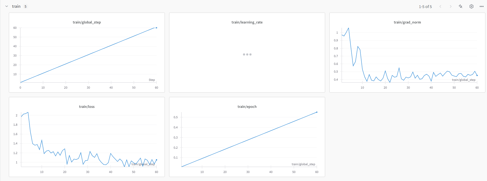
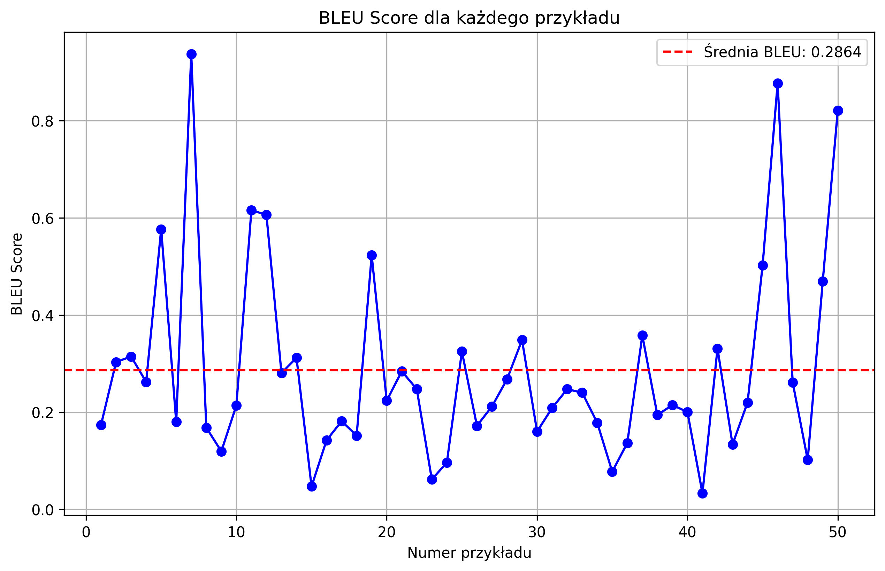

# Generator przepisów kulinarnych – Cookbook Chatbot

## Opis projektu
Projekt ten polega na stworzeniu modelu językowego, który generuje przepisy kulinarne na podstawie nazwy potrawy. Model jest trenowany na danych zawierających przepisy kulinarne, a jego celem jest ułatwienie tworzenia szczegółowych instrukcji kulinarnych oraz dopasowanych do nich składników. Proces obejmuje podział danych, przetwarzanie wstępne, trenowanie modelu, generowanie wyników i ocenę jakości przy użyciu BLEU Score.

---

## Struktura projektu

### Pliki

- **`data_preprocessing.py`** - Skrypt do przetwarzania wstępnych danych i ich formatowania na potrzeby modelu językowego.
- **`evaluate.py`** - Skrypt do oceny jakości generowanych przepisów za pomocą BLEU Score i wizualizacji wyników.
- **`inference.py`** - Interaktywny chatbot, który generuje przepisy kulinarne na podstawie podanej potrawy lub składników.
- **`model_utils.py`** - Skrypt zawierający funkcje do ładowania modelu i konfiguracji PEFT (Parameter Efficient Fine-Tuning).
- **`split_data.py`** - Skrypt do podziału danych na zbiory treningowy i testowy.
- **`train.py`** - Skrypt do trenowania modelu językowego z użyciem frameworka `unsloth`.
---

## Instrukcja użytkowania

### 1. Przygotowanie danych
Dane wejściowe powinny znajdować się w pliku `data/modified_recipes2_with_calories_cleaned.csv`. Podziel dane na zbiory treningowy i testowy za pomocą `split_data.py`:

```bash
python split_data.py
```

Po podziale w folderze `data` znajdziesz:
- `train_products.csv` - Zbiór treningowy.
- `test_products.csv` - Zbiór testowy.

---

### 2. Trenowanie modelu
Uruchom `train.py`, aby przeprowadzić trening modelu językowego:

```bash
python train.py
```

Model bazowy: **`unsloth/gemma-2-9b-it-bnb-4bit`**. Wynikowy model zostanie zapisany w folderze `fine-tuned-diet`.

---

### 3. Generowanie przepisów
Uruchom `inference.py`, aby rozpocząć interaktywną sesję z chatbotem, który generuje przepisy kulinarne:

```bash
python inference.py
```

- Wprowadź nazwę potrawy, aby otrzymać przepis.
- Wpisz `exit`, aby zakończyć sesję.

---

### 4. Ocena wyników
Użyj `evaluate.py` do oceny jakości generowanych przepisów za pomocą BLEU Score. Skrypt wizualizuje wyniki dla danych testowych:

```bash
python evaluate.py
```

Wyniki:
- Średni BLEU Score : ```0,2864```
- Wykres BLEU Score (`bleu_score_plot.png`).

---

## Wykres treningu


## Wykres BLEU Score



### Analiza wyników
- Wykres przedstawia BLEU Score dla 50 pierwszych przykładów z danych testowych.
- **Średnia BLEU Score**: Wynik 0.2864 jest typowy dla wielu generatywnych modeli, które nie są perfekcyjne. Taki wynik sugeruje, że model odtwarza pewne struktury i słownictwo podobne do referencyjnego tekstu, ale nie odzwierciedla dokładnie treści.

---

## Kluczowe funkcje

### Split danych (`split_data.py`)
- Podział danych na zbiory treningowy i testowy.
- Wejście: `data/modified_recipes2_with_calories_cleaned.csv`.
- Wyjście: Pliki CSV w folderze `data`.

---

### Przetwarzanie danych (`data_preprocessing.py`)
- Dane formatujące w postaci promptów:
  - **Instruction**: Tytuł przepisu.
  - **Input**: Lista składników.
  - **Response**: Instrukcje przygotowania.
- Dane są zapisywane w formacie kompatybilnym z treningiem modeli językowych.

---

### Trenowanie modelu (`train.py`)
- Model bazowy: `unsloth/gemma-2-9b-it-bnb-4bit`.
- Technika fine-tuningu: PEFT z gradient checkpointing.
- Hyperparametry:
  - Batch size: 2
  - Gradient accumulation: 4
  - Learning rate: 2e-4
  - Maksymalna długość sekwencji: 2048
  - Warmup steps: 5
  - Lora Alpha: 16
  - Target modules: q_proj, k_proj, v_proj, o_proj.
- Wynik: Model zapisany w folderze `fine-tuned-diet`.

---

### Inference (`inference.py`)
- Interaktywny chatbot do generowania przepisów.
- Funkcjonalności:
  - Generowanie instrukcji przygotowania posiłku.
  - Dopasowanie składników do nazwy potrawy.
- Model używa metody `FastLanguageModel` z frameworka `unsloth`.

---

### Ocena BLEU (`evaluate.py`)
- BLEU Score obliczany jako miara dopasowania wygenerowanych przepisów do oczekiwanych wyników.
- Wizualizacja wyników za pomocą wykresu.

---

## Wymagania systemowe

- **Python**: 3.11.11
- **Frameworki**:
  - `Transformers==4.47.1`
  - `unsloth==2024.12.11`
  - `unsloth-zoo==2024.12.6`
  - `trl`
- **Biblioteki**:
  - torch
  - pandas
  - nltk
  - matplotlib
